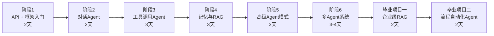

# 从零搭建 AI Agent 学习计划 🚀（框架版）

> **方针**：以 LangChain + LangGraph 框架为主线，边用边讲原理，快速上手。
> **模型**：国产模型（通义千问 / DeepSeek / 智谱 / Kimi）+ Gemini，统一通过 OpenAI 兼容接口调用。
> **时间**：每天 4-6 小时，预计 **2.5 周** 完成全部内容。

---

## 技术栈一览

| 类别 | 选型 | 说明 |
|------|------|------|
| 框架 | **LangChain** + **LangGraph** | 主流 Agent 框架，生态丰富 |
| 模型接口 | `langchain-openai` + `langchain-google-genai` | 国产模型走 OpenAI 兼容接口，Gemini 用官方包 |
| 向量数据库 | **ChromaDB**（本地轻量） | 学习阶段足够，无需部署 |
| 记忆存储 | **SQLite** | 轻量持久化 |
| 包管理 | **uv** 或 **pip** | 推荐 uv，更快 |

### 国产模型 API 兼容说明

> [!NOTE]
> 绝大多数国产模型都兼容 OpenAI 接口格式，只需替换 `base_url` 和 `api_key` 即可。

| 模型 | base_url | 备注 |
|------|----------|------|
| 通义千问 (Qwen) | `https://dashscope.aliyuncs.com/compatible-mode/v1` | 阿里云，模型名如 `qwen-plus` |
| DeepSeek | `https://api.deepseek.com` | 性价比极高，模型名如 `deepseek-chat` |
| 智谱 (GLM) | `https://open.bigmodel.cn/api/paas/v4` | 模型名如 `glm-4-flash` |
| Kimi (Moonshot) | `https://api.moonshot.cn/v1` | 模型名如 `moonshot-v1-8k` |

---

## 学习路线总览



---

## 阶段 1：API 基础与 LangChain 入门（2 天）

### 学习目标
- 配置多模型统一调用环境
- 掌握 LangChain 核心抽象：Model / Prompt / Chain / OutputParser
- 理解框架在底层做了什么

### Day 1：环境搭建 + 多模型调用

```
project_01_basics/
├── .env                        # API Keys 配置
├── requirements.txt            # 依赖清单
├── 01_raw_api_call.py          # 不用框架，直接用 requests 调 API（理解原理）
├── 02_langchain_models.py      # 用 LangChain 调用多个模型（一套代码切换模型）
└── 03_model_comparison.py      # 同一问题让多个模型回答，对比效果
```

**原理讲解**：
- LangChain 的 `ChatOpenAI` 底层就是在拼 HTTP 请求，帮你处理了消息格式、重试、流式等
- `base_url` 参数让你用同一个类调用所有 OpenAI 兼容接口的模型

### Day 2：Prompt 工程 + Chain 组合

```
project_01_basics/
├── 04_prompt_templates.py      # PromptTemplate 和 ChatPromptTemplate
├── 05_output_parsers.py        # 结构化输出（JSON、Pydantic）
├── 06_lcel_chains.py           # LCEL 链式调用（prompt | model | parser）
└── 07_streaming.py             # 流式输出实现
```

**原理讲解**：
- LCEL（LangChain Expression Language）本质是管道模式（pipe），`A | B | C` 就是 `C(B(A(input)))`
- OutputParser 的本质就是正则/JSON解析，框架帮你封装了错误处理和重试

---

## 阶段 2：构建对话 Agent（2 天）

### 学习目标
- 用 LangChain 构建一个有上下文记忆的对话 Agent
- 理解消息历史管理的原理
- 实现多种对话模式

### Day 3：基础对话 Agent

```
project_02_chat_agent/
├── 01_simple_chatbot.py        # 最简单的对话循环
├── 02_chat_with_history.py     # 带消息历史的对话（理解消息列表的管理）
├── 03_chat_with_persona.py     # 自定义角色的对话 Agent
└── config.py                   # 统一配置（模型选择、参数等）
```

### Day 4：对话管理进阶

```
project_02_chat_agent/
├── 04_session_manager.py       # 多会话管理（不同用户/话题独立历史）
├── 05_context_window.py        # Token 窗口管理（防溢出策略）
└── 06_chat_app.py              # 综合：一个功能完整的命令行聊天应用
```

**原理讲解**：
- "记忆"在这个阶段就是一个消息列表 `List[Message]`，每次请求全部发给 LLM
- Token 溢出的解决：截断旧消息 / 摘要压缩 / 滑动窗口
- LangChain 的 `ChatMessageHistory` 底层就是在维护这个列表

---

## 阶段 3：工具调用 Agent — Function Calling（3 天）⭐

> [!IMPORTANT]
> 这是 Agent 的核心能力。掌握了工具调用，Agent 就能"做事"了。

### 学习目标
- 理解 Function Calling 的底层机制
- 用 LangChain 的 `@tool` 装饰器快速创建工具
- 构建能自主选择和使用工具的 Agent

### Day 5：Function Calling 原理 + 第一个工具

```
project_03_tool_agent/
├── 01_function_calling_raw.py  # 不用框架，手动实现 Function Calling（理解原理）
├── 02_langchain_tools.py       # 用 @tool 装饰器创建工具
├── 03_tool_binding.py          # 将工具绑定到模型（bind_tools）
└── tools/
    ├── __init__.py
    └── calculator.py           # 计算器工具
```

**原理讲解**：
- Function Calling 本质：LLM 不执行代码，它只是输出一段 JSON（函数名 + 参数）
- 你的代码负责解析 JSON → 执行函数 → 把结果作为新消息发回给 LLM
- `@tool` 装饰器做了什么：读取函数签名和 docstring，自动生成 JSON Schema

### Day 6：丰富工具集 + Agent 循环

```
project_03_tool_agent/
├── 04_agent_loop.py            # 完整的 Agent 工具调用循环
├── 05_error_handling.py        # 工具调用的错误处理和重试
├── tools/
│   ├── web_search.py           # 网络搜索工具
│   ├── file_ops.py             # 文件读写工具
│   ├── system_info.py          # 系统信息工具
│   └── code_executor.py        # Python 代码执行工具（沙箱）
```

### Day 7：用 LangGraph 构建工具 Agent

```
project_03_tool_agent/
├── 06_langgraph_agent.py       # 用 LangGraph 重写 Agent（图结构）
├── 07_tool_agent_complete.py   # 完整版：支持多工具的命令行 Agent
└── tools/
    └── ...                     # 复用上面的工具
```

**原理讲解**：
- LangGraph 的本质是一个**状态机**：定义节点（Node）和边（Edge），Agent 按图执行
- 相比手写 while 循环，LangGraph 提供了更清晰的流程控制和状态管理
- 条件边（Conditional Edge）让 Agent 能根据情况决定下一步做什么

---

## 阶段 4：记忆与 RAG（3 天）

### 学习目标
- 实现跨会话的长期记忆
- 理解 Embedding 和向量检索的原理
- 用 LangChain + ChromaDB 构建 RAG 系统

### Day 8：长期记忆

```
project_04_memory_rag/
├── 01_short_term_memory.py     # 对话内记忆（复习 + 深化）
├── 02_long_term_memory.py      # 跨会话记忆（SQLite 存储用户偏好/事实）
├── 03_memory_agent.py          # 集成记忆的 Agent（能记住你是谁、你的喜好）
```

### Day 9：Embedding + 向量检索

```
project_04_memory_rag/
├── 04_embedding_basics.py      # Embedding 原理：文本 → 向量 → 相似度
├── 05_vector_store.py          # ChromaDB 本地向量库的增删改查
├── 06_document_loader.py       # 加载各种格式的文档（PDF、Markdown、TXT）
└── 07_text_splitter.py         # 文本分块策略（对 RAG 效果影响很大）
```

**原理讲解**：
- Embedding 就是把文本变成一个高维向量（如 1536 维），语义相近的文本向量距离近
- 向量检索就是"找到和问题向量最接近的几个文档块"
- ChromaDB 底层用的是近似最近邻算法（ANN）

### Day 10：完整 RAG Agent

```
project_04_memory_rag/
├── 08_simple_rag.py            # 最简 RAG：加载文档 → 分块 → 嵌入 → 检索 → 生成
├── 09_rag_agent.py             # RAG 作为 Agent 的一个工具
└── 10_knowledge_base_app.py    # 综合：个人知识库问答应用
```

---

## 阶段 5：高级 Agent 模式（3 天）

### 学习目标
- 用 LangGraph 实现 ReAct 模式
- 实现任务规划（Planning）能力
- 理解 Agent 的自我反思与纠错

### Day 11：ReAct Agent

```
project_05_advanced/
├── 01_react_concept.py         # ReAct 原理演示（Thought → Action → Observation 循环）
├── 02_langgraph_react.py       # 用 LangGraph 实现 ReAct Agent
└── 03_react_with_tools.py      # ReAct Agent + 丰富工具集
```

**原理讲解**：
- ReAct = Reasoning + Acting，让 LLM 先"想"再"做"
- 本质是在 Prompt 中要求 LLM 按固定格式输出思考过程
- LangGraph 的 `create_react_agent` 封装了整个 ReAct 循环

### Day 12：Planning Agent

```
project_05_advanced/
├── 04_plan_and_execute.py      # Plan-and-Execute 模式
├── 05_dynamic_replanning.py    # 动态重新规划（执行中发现问题，调整计划）
```

### Day 13：自我反思 + 综合 Agent

```
project_05_advanced/
├── 06_self_reflection.py       # Agent 检查自己的输出、自我纠错
├── 07_human_in_the_loop.py     # 人类介入（关键决策请求人类确认）
└── 08_super_agent.py           # 综合：集成所有能力的全功能 Agent
```

---

## 阶段 6：多 Agent 协作系统（3-4 天）

### 学习目标
- 理解多 Agent 协作的架构模式
- 用 LangGraph 构建多 Agent 工作流
- 构建一个有实际价值的多 Agent 系统

### Day 14：多 Agent 基础

```
project_06_multi_agent/
├── 01_multi_agent_concepts.py  # 多 Agent 架构模式（主从/对等/辩论）
├── 02_agent_communication.py   # Agent 之间的消息传递
```

### Day 15：LangGraph 多 Agent 实战

```
project_06_multi_agent/
├── 03_supervisor_pattern.py    # 主管模式：一个 Agent 分配任务给其他 Agent
├── 04_collaborative_agents.py  # 协作模式：多个 Agent 接力完成任务
```

**原理讲解**：
- 多 Agent 本质是多个 LLM 调用的编排，每个 Agent 有不同的 System Prompt 和工具集
- Supervisor 模式：一个"经理" Agent 决定把任务分给谁
- 协作模式：Agent 按流程图接力工作

### Day 16-17：综合项目

```
project_06_multi_agent/
├── 05_research_team/           # 综合项目：AI 调研团队
│   ├── agents/
│   │   ├── researcher.py       # 调研 Agent（搜索信息）
│   │   ├── analyst.py          # 分析 Agent（整理分析）
│   │   └── writer.py           # 写作 Agent（生成报告）
│   ├── workflow.py             # LangGraph 工作流定义
│   └── main.py                 # 入口
```

**目标产出**：输入一个主题 → 调研 Agent 收集信息 → 分析 Agent 提炼要点 → 写作 Agent 生成完整报告。

---

## 毕业项目：企业级 RAG 智能知识库问答 Agent（2 天）

> [!IMPORTANT]
> 这是整个课程的毕业项目，综合运用 Day 1-17 所学的全部核心能力。

### 学习目标
- 将基础 RAG 升级为企业级架构：多路召回、混合分块、质量闭环
- 实现对话记忆与指代消解，支持多轮连续问答
- 实现来源溯源，回答可追溯到原文档页码
- 用 LangGraph 编排完整的 6 节点 RAG 工作流

### Day 18：企业级 RAG 架构设计

```
project_07_enterprise_rag/
├── config.py                    # 项目配置
├── ingestion/
│   ├── loader.py                # DocumentLoaderFactory（PDF/DOCX/MD/TXT）
│   └── chunker.py               # HybridChunker（标题感知 + 语义边界）
├── retrieval/
│   ├── vector_store.py          # VectorStoreManager（ChromaDB）
│   ├── keyword_search.py        # KeywordSearcher（BM25 + jieba）
│   ├── hybrid_retriever.py      # HybridRetriever（RRF 融合）
│   └── reranker.py              # LLMReranker（LLM 打分重排）
└── requirements.txt
```

**核心升级**：
- 多格式文档加载（PDF/DOCX/MD/TXT）
- 标题感知 + 语义边界的混合分块
- 向量检索 + BM25 关键词检索双路召回 + RRF 融合
- LLM 重排序精排过滤

### Day 19：工作流编排与完整应用

```
project_07_enterprise_rag/
├── memory/
│   └── conversation_store.py    # ConversationStore（SQLite 多会话）
├── citation/
│   └── source_tracker.py        # SourceTracker（引用标注 + 溯源列表）
├── graph/
│   ├── state.py                 # EnterpriseRAGState
│   └── workflow.py              # 6 节点 LangGraph 状态图
└── main.py                      # CLI 入口
```

**核心能力**：
- 对话记忆 + LLM 指代消解（IntentResolver）
- 来源追踪：引用标注 [1][2] + 末尾引用列表
- LangGraph 6 节点图：意图解析→混合检索→重排→生成→质量检查→格式化
- 质量闭环：LLM 自评 + 重试循环（最多 2 次）
- CLI 交互：/import、/history、/session 等命令

---

## 毕业项目二：自动化业务流程调度 Agent（2 天）

> [!IMPORTANT]
> 面试高频深挖项目，工业级落地最强的「应用型 Agent」。

### 学习目标
- 掌握统一工具注册机制（ToolRegistry）：注册、校验、权限、分组
- 掌握 LLM 驱动的任务拆解：将复杂指令分解为可执行子任务链
- 实现日报/周报全自动生成流程，替代人工整理工作
- 掌握指数退避重试、降级替代、异常日志等容错机制
- 实现 Cron 定时调度 + 事件触发双模式

### Day 20：工具注册机制与任务拆解

```
project_08_workflow_agent/
├── config.py                    # 项目配置
├── tools/
│   ├── registry.py              # ToolRegistry 统一注册中心
│   ├── file_tools.py            # 文件处理（读/写/归档/清理）
│   ├── excel_tools.py           # Excel 读写（openpyxl）
│   ├── data_tools.py            # 数据清洗/统计/转换
│   ├── text_tools.py            # 文本提取/格式化
│   ├── notify_tools.py          # 消息推送（模拟企业微信/邮件）
│   └── schedule_tools.py        # 定时任务注册/查询
├── planner/
│   └── task_planner.py          # TaskPlanner 任务拆解
└── requirements.txt
```

**核心能力**：
- ToolRegistry：注册/分组/校验/权限/降级替代/调用日志
- 10+ 业务工具：文件、Excel、数据清洗、文本、通知、调度
- TaskPlanner：工具约束感知的 LLM 任务拆解
- ExecutionPlan + 拓扑排序 + 依赖解析

### Day 21：执行引擎、容错重试与定时调度

```
project_08_workflow_agent/
├── executor/
│   └── workflow_engine.py       # LangGraph 执行引擎
├── reports/
│   └── report_generator.py      # 日报/周报生成器
├── error_handler/
│   └── retry.py                 # 指数退避重试 + 降级替代 + 异常日志
├── scheduler/
│   └── task_scheduler.py        # Cron 定时 + 事件触发
├── graph/
│   ├── state.py                 # WorkflowState
│   └── workflow.py              # 4 节点执行图
└── main.py                      # CLI 入口
```

**核心能力**：
- LangGraph 4 节点执行图：plan → execute → validate → report
- 质量闭环：LLM 校验 + 重新规划（最多 2 次）
- RetryHandler：指数退避重试 + 降级替代
- ErrorLogger：异常日志持久化
- TaskScheduler：Cron 定时调度 + 目录监控触发
- ReportGenerator：日报/周报全自动生成 + 推送通知

---

## 毕业项目三：多智能体协同开发助手系统（2 天）

> [!IMPORTANT]
> 高阶、架构级项目，面试加分极强。解决单智能体复杂任务能力不足的问题，实现软件开发全流程辅助。

### 学习目标
- 掌握四角色智能体架构：规划/开发/测试/文档
- 掌握多 Agent 消息通信与任务流转机制
- 实现"写代码→查代码→改代码"自检闭环
- 实现从需求输入到项目交付的全自动闭环

### Day 22：角色分工与消息通信

```
project_09_dev_team/
├── agents/
│   ├── __init__.py
│   ├── planner.py               # 规划Agent（需求分析、任务拆解、架构设计）
│   ├── developer.py             # 开发Agent（代码编写、Bug 修复）
│   ├── tester.py                # 测试Agent（代码审查、BUG 检测、安全扫描）
│   └── docwriter.py             # 文档Agent（注释、API 文档、README）
├── messages/
│   ├── __init__.py
│   └── message_bus.py           # Agent 间消息总线
├── graph/
│   ├── __init__.py
│   └── state.py                 # DevTeamState 定义
└── requirements.txt
```

**核心能力**：
- 四角色 System Prompt 设计 + 工具隔离
- MessageBus 消息总线 + TaskAssignment/TaskResult 结构
- 规划 Agent 的需求结构化拆解（模糊需求→功能点+接口清单+任务列表）
- 多 Agent 编排三种模式：线性流水线 / 主管调度 / 流水线+反馈循环

### Day 23：工作流编排与自动交付

```
project_09_dev_team/
├── graph/
│   └── workflow.py              # 6 节点 LangGraph 工作流
├── templates/
│   └── bug_report.md            # Bug 反馈模板
├── data/
│   └── output/                  # 产出目录
└── main.py                      # CLI 入口
```

**核心能力**：
- LangGraph 6 节点工作流：planner→developer→tester→fixer→docwriter→deliver
- "写→查→改"自检闭环（最多 3 轮修复循环）
- 代码产物解析与持久化
- 完整交付报告生成（架构+代码+测试+文档+协作统计）
- CLI 交互式开发流程

---

## 项目结构总览

```
/Users/huangyang/code/agent/
├── .env                          # 环境变量配置文件（管理 API Key）
├── .env.example                  # 环境变量配置模板文件
├── .flake8                       # Flake8 代码格式校验配置文件
├── requirements.txt              # 统一项目依赖包声明文件
├── LEARNING_PLAN.md              # 课程学习计划大纲文档（当前文档）
├── walkthrough.md                # 评审修复与进度指引文档
├── common/                       # 公共模块目录（跨项目复用）
│   ├── __init__.py               # 模块初始化
│   ├── model_factory.py          # 公共模型工厂（统一大模型创建接口）
│   ├── colors.py                 # 终端 ANSI 颜色常量
│   └── config.py                 # 全局配置读取模块
├── project_01_basics/            # 阶段 1：API 与框架入门基础目录
├── project_02_chat_agent/        # 阶段 2：对话 Agent 与消息管理目录
├── project_03_tool_agent/        # 阶段 3：工具调用与 LangGraph 入门目录
├── project_04_memory_rag/        # 阶段 4：记忆持久化与知识库 RAG 目录
├── project_05_advanced/          # 阶段 5：高级 ReAct 与 Planning 规划目录
├── project_06_multi_agent/       # 阶段 6：多 Agent 协作与综合项目实战目录
├── project_07_enterprise_rag/    # 毕业项目一：企业级 RAG 智能知识库问答 Agent
├── project_08_workflow_agent/    # 毕业项目二：自动化业务流程调度 Agent
└── project_09_dev_team/          # 毕业项目三：多智能体协同开发助手系统
```
