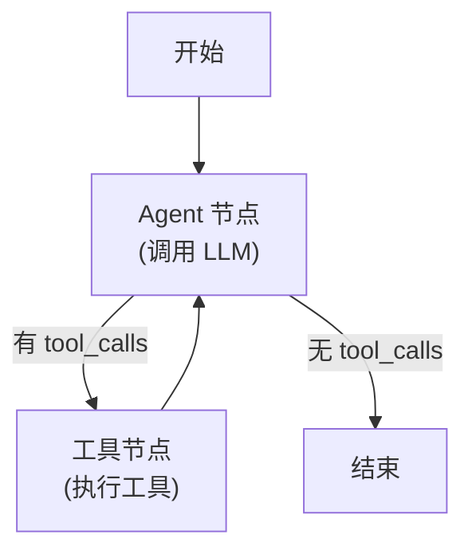

# Day 7 课程：用 LangGraph 构建工具 Agent — 从 While 循环到状态机 🕸️

在 Day 6 中，我们用一个 `while` 循环 + `if tool_calls` 条件判断手写了 Agent Loop。它能工作，但存在几个工程上的硬伤：

1. **流程不直观**：所有逻辑都塞在一个函数里，随着功能增加（如人类审批、并行工具调用、条件分支），代码会变得越来越像一碗意大利面。
2. **状态管理混乱**：消息列表 `messages` 是一个裸数组，没有统一的状态容器来管理 Agent 的各种运行时数据。
3. **缺乏可视化**：无法直观地看到 Agent 的执行路径和决策过程。

**LangGraph** 正是为解决这些问题而生的。它把 Agent 的执行流程建模为一张**有向图 (Directed Graph)**，每个节点（Node）是一个处理步骤，每条边（Edge）是步骤之间的转移逻辑。

---

## 目录
1. [学习目标](#学习目标)
2. [第一部分：LangGraph 核心概念](#第一部分langgraph-核心概念)
3. [第二部分：用 LangGraph 重写工具 Agent](#第二部分用-langgraph-重写工具-agent)
4. [第三部分：完整版多工具命令行 Agent](#第三部分完整版多工具命令行-agent)
5. [核心原理深度解析](#核心原理深度解析)
6. [课后练习](#课后练习)

---

## 学习目标
- 掌握 LangGraph 的三大核心概念：**状态 (State)**、**节点 (Node)**、**边 (Edge)**。
- 理解 LangGraph 与手写 `while` 循环的本质对比。
- 学会使用 `StateGraph` 构建工具调用 Agent。
- 掌握条件边 (Conditional Edge) 实现动态分支决策。
- 使用 `create_react_agent` 快速创建开箱即用的 ReAct Agent。

---

## 第一部分：LangGraph 核心概念

### 1. 什么是 LangGraph？

LangGraph 是 LangChain 团队开发的 Agent 编排框架。它的设计哲学是：

> **把 Agent 的执行流程看作一张图（Graph），图的每个节点是一个处理步骤，图的每条边是步骤之间的流转逻辑。**

```
     ┌─────────┐         ┌───────────┐
     │  START   │────────►│  agent    │◄────────────────┐
     └─────────┘         │ (调用LLM)  │                 │
                         └─────┬─────┘                 │
                               │                       │
                         ┌─────▼─────┐                 │
                         │ 有tool_calls?│                │
                         └──┬─────┬──┘                 │
                        YES │     │ NO                  │
                            ▼     ▼                    │
                    ┌──────────┐ ┌──────┐              │
                    │  tools   │ │ END  │              │
                    │ (执行工具) │ └──────┘              │
                    └─────┬────┘                       │
                          │                            │
                          └────────────────────────────┘
```

### 2. 三大核心概念

#### 概念一：状态 (State)
State 是在图的所有节点之间流转的**共享数据容器**。在 Agent 场景中，State 通常包含消息历史列表：

```python
from typing import Annotated
from typing_extensions import TypedDict
from langgraph.graph.message import add_messages

class AgentState(TypedDict):
    """Agent 的状态定义。

    Attributes:
        messages: 对话消息列表，使用 add_messages 注解实现自动追加。
    """
    messages: Annotated[list, add_messages]
```

> ⚠️ **关键细节**：`Annotated[list, add_messages]` 中的 `add_messages` 是一个**归约器 (Reducer)**。它告诉 LangGraph：当节点返回新消息时，不要覆盖旧列表，而是**追加**到列表末尾。这和我们之前手动 `messages.append()` 是一样的效果，但由框架自动管理。

#### 概念二：节点 (Node)
节点是图中的处理步骤。每个节点是一个 Python 函数，接收当前 State 作为输入，返回需要更新的 State 字段：

```python
def agent_node(state: AgentState):
    """Agent 节点：调用大模型进行推理。

    Args:
        state: 当前 Agent 状态。

    Returns:
        包含模型响应消息的字典。
    """
    # 调用绑定了工具的模型
    response = model_with_tools.invoke(state["messages"])
    # 返回要更新的字段（会通过 add_messages 追加到 messages 列表）
    return {"messages": [response]}


def tool_node(state: AgentState):
    """工具节点：执行模型请求的工具调用。

    Args:
        state: 当前 Agent 状态。

    Returns:
        包含工具执行结果消息的字典。
    """
    last_message = state["messages"][-1]
    results = []
    for tool_call in last_message.tool_calls:
        # 查找并执行对应工具
        tool = tool_map[tool_call["name"]]
        result = tool.invoke(tool_call["args"])
        # 封装为 ToolMessage
        results.append(
            ToolMessage(content=str(result), tool_call_id=tool_call["id"])
        )
    return {"messages": results}
```

#### 概念三：边 (Edge)
边定义了节点之间的转移逻辑。LangGraph 支持两种边：

- **普通边 (Normal Edge)**：无条件跳转。例如：工具执行完毕后，无条件回到 Agent 节点。
- **条件边 (Conditional Edge)**：根据当前 State 动态决定跳转方向。例如：Agent 节点执行后，根据是否有 `tool_calls` 决定是去工具节点还是结束。

```python
def should_continue(state: AgentState) -> str:
    """路由函数：决定 Agent 下一步走向。

    Args:
        state: 当前 Agent 状态。

    Returns:
        "tools" 表示需要执行工具，"end" 表示任务完成。
    """
    last_message = state["messages"][-1]
    # 如果最新消息包含 tool_calls，则流转到工具节点
    if last_message.tool_calls:
        return "tools"
    # 否则任务完成，流转到终点
    return "end"
```

### 3. 组装图

```python
from langgraph.graph import StateGraph, END

# 创建状态图
graph = StateGraph(AgentState)

# 添加节点
graph.add_node("agent", agent_node)
graph.add_node("tools", tool_node)

# 设置入口节点
graph.set_entry_point("agent")

# 添加条件边：agent 节点之后，根据条件决定走向
graph.add_conditional_edges(
    "agent",                          # 源节点
    should_continue,                  # 路由函数
    {
        "tools": "tools",             # 返回 "tools" → 跳转到 tools 节点
        "end": END                    # 返回 "end" → 流程结束
    }
)

# 添加普通边：工具执行完后，无条件回到 agent 节点
graph.add_edge("tools", "agent")

# 编译图（生成可执行的 Runnable）
app = graph.compile()
```

> 📖 **代码实战**：查看并运行 [06_langgraph_agent.py](file:///Users/huangyang/code/agent/project_03_tool_agent/06_langgraph_agent.py)

---

## 第二部分：用 LangGraph 重写工具 Agent

### 1. 手写循环 vs. LangGraph 的完整对比

| 维度 | 手写 while 循环 (Day 6) | LangGraph (Day 7) |
|------|----------------------|-------------------|
| 流程定义 | 隐含在 if-else 逻辑中 | 显式的图结构，一目了然 |
| 状态管理 | 裸列表 `messages = []` | 类型安全的 `TypedDict` + 自动归约 |
| 新增分支 | 改动核心循环代码（高风险） | 添加新节点和边（低风险） |
| 可视化 | 无 | 支持 `graph.get_graph().draw_mermaid()` |
| 断点调试 | 困难 | 支持 checkpoint、time-travel 等高级调试 |
| 人类介入 | 需要手动实现 | 内置 `interrupt_before` / `interrupt_after` |
| 并行执行 | 需要手写线程 | 支持 Send API 并行分支 |

### 2. 图结构的可视化

LangGraph 生成的图可以导出为 Mermaid 图表，直观地看到 Agent 的决策路径：



### 3. 使用 `create_react_agent` 快捷创建

对于标准的"推理 + 工具调用"模式，LangGraph 提供了一个开箱即用的工厂函数：

```python
from langgraph.prebuilt import create_react_agent

# 一行代码创建完整的 ReAct Agent
agent = create_react_agent(
    model=model,
    tools=[get_weather, calculate, web_search]
)

# 直接使用
result = agent.invoke({
    "messages": [HumanMessage(content="北京天气怎么样？")]
})
```

`create_react_agent` 内部自动完成了：
1. 定义 `AgentState`（含 `messages` 列表）
2. 创建 Agent 节点（调用 `model.bind_tools(tools)`）
3. 创建工具节点（自动派发 `tool_calls` 到对应工具）
4. 添加条件边（根据 `tool_calls` 路由）
5. 编译图

> 📖 **代码实战**：查看并运行 [06_langgraph_agent.py](file:///Users/huangyang/code/agent/project_03_tool_agent/06_langgraph_agent.py)

---

## 第三部分：完整版多工具命令行 Agent

将 LangGraph Agent 与我们之前学习的所有能力（对话历史、角色切换、多工具集）整合，构建一个完整的命令行 Agent：

### 1. 功能架构

```
ToolAgent (完整版)
├── LangGraph StateGraph        # 图结构执行引擎
│   ├── agent_node              # LLM 推理节点
│   └── tool_node               # 工具执行节点
├── Tools                       # 丰富工具集
│   ├── calculator              # 精确数学运算
│   ├── web_search              # 网络搜索（模拟）
│   ├── file_ops                # 文件读写
│   ├── system_info             # 系统信息
│   └── code_executor           # Python 代码执行
├── ChatHistory                 # 对话历史管理
├── TokenManager                # Token 窗口控制
└── CLI Interface               # 终端交互界面
    ├── 普通对话                 # 直接输入文字
    ├── /tools                  # 列出所有可用工具
    ├── /history                # 查看对话历史
    ├── /clear                  # 清空历史
    └── /quit                   # 退出
```

### 2. 执行过程示例

```
用户 > 帮我算一下 sin(45°) 的值，然后把结果写入到 result.txt 文件中

🤔 思考中...
📧 调用工具: calculate
   参数: {"expression": "math.sin(math.radians(45))"}
   结果: 0.7071067811865476

📧 调用工具: write_file
   参数: {"filepath": "result.txt", "content": "sin(45°) = 0.7071067811865476"}
   结果: 文件 'result.txt' 写入成功

🤖 AI > sin(45°) 的值约为 0.7071。我已经将结果写入到 result.txt 文件中了。
```

> 📖 **代码实战**：查看并运行 [07_tool_agent_complete.py](file:///Users/huangyang/code/agent/project_03_tool_agent/07_tool_agent_complete.py)

---

## 核心原理深度解析

### LangGraph 的本质：有限状态机 (FSM)

LangGraph 的底层模型是一个**有限状态机 (Finite State Machine)**：

```
状态 (State)   = AgentState（包含 messages 等数据）
状态转移       = 节点函数的执行 + 边的路由逻辑
初始状态       = 用户输入构建的初始 State
终止状态       = 到达 END 节点
```

与传统状态机不同，LangGraph 的状态转移函数可以包含**LLM 调用**——这意味着状态转移的方向是由大模型在运行时动态决定的，而不是在编码时写死的。

### Reducer 归约器的工作原理

`add_messages` 是 LangGraph 中最常用的 Reducer。它的行为规则是：

```python
# 当节点返回 {"messages": [new_msg]} 时

# ❌ 不是覆盖
state["messages"] = [new_msg]

# ✅ 而是追加
state["messages"] = state["messages"] + [new_msg]
```

这个机制确保了消息历史不会因为节点返回而丢失，每个节点的输出都会累积到完整的对话上下文中。

### Checkpoint：图执行的"存档点"

LangGraph 支持在图执行过程中自动保存 Checkpoint（存档点），类似游戏存档。这使得：
- **断点恢复**：Agent 执行到一半崩溃，可以从最近的 Checkpoint 恢复。
- **Time Travel**：可以回溯到任意历史节点，查看当时的 State 内容。
- **人类介入**：在特定节点暂停执行，等待人类审批后继续。

```python
from langgraph.checkpoint.memory import MemorySaver

# 创建内存存档器
checkpointer = MemorySaver()

# 编译图时传入存档器
app = graph.compile(checkpointer=checkpointer)

# 调用时指定 thread_id（类似会话 ID）
config = {"configurable": {"thread_id": "user_001"}}
result = app.invoke({"messages": [HumanMessage(content="你好")]}, config)
```

---

## 课后练习

1. **图结构可视化**：使用 `graph.get_graph().draw_mermaid()` 导出你的 Agent 图结构，粘贴到 Markdown 文件中查看渲染效果。

2. **添加"人类确认"节点**：在工具节点执行前添加一个确认节点——当 Agent 要执行"写文件"或"执行代码"等敏感操作时，先暂停并询问用户"是否确认执行？"，用户输入 `y` 后才继续。

3. **对比实验**：分别使用 `create_react_agent` 和手动构建 `StateGraph` 两种方式，对同一组测试问题运行 Agent，对比两者的执行结果是否一致。

4. **Checkpoint 实验**：启用 `MemorySaver`，进行一段对话后，使用 `app.get_state(config)` 查看当前 State 的完整内容，体验"状态快照"的概念。

5. **Flake8 自检**：确保代码通过 `flake8 project_03_tool_agent/` 的检查。
