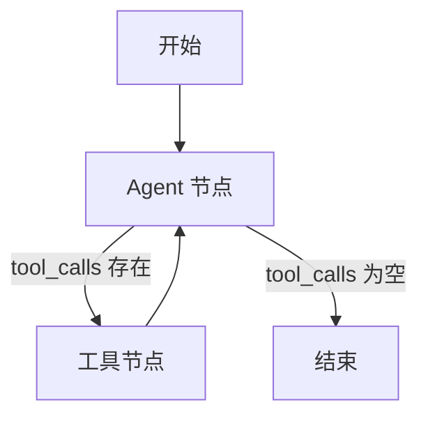

# Day 11 课程：ReAct Agent — 让 Agent 学会"先想再做" 🧠⚡

在 Day 7 中，我们已经通过 LangGraph 的 `create_react_agent` 函数构建了能够执行工具的 Agent。但对于初学者来说，那时的 `create_react_agent` 更像是一个被高度封装的“黑盒”——模型在后台如何输出工具调用、如何串联起思考过程，我们难以窥见全貌。

本章的目的是在 Day 7 的基础上，**深化对 ReAct 模式的核心学术原理及底层设计逻辑的探索**。我们将拆解 ReAct（Reasoning + Acting）模式的核心，解析大模型在每次行动之前，如何通过**显式输出思考过程（Thought）**、**执行动作（Action）**并**观察结果（Observation）**，来进行自我修正和迭代。

通过本章学习，你不仅能够理解黑盒背后的运行机制，还能掌握如何通过精细的 Prompt 工程调试并优化 Agent 的思考链，使其决策过程透明、可控且高效。

---

## 目录
1. [学习目标](#学习目标)
2. [第一部分：ReAct 原理](#第一部分react-原理)
3. [第二部分：用 LangGraph 实现 ReAct Agent](#第二部分用-langgraph-实现-react-agent)
4. [第三部分：ReAct Agent + 丰富工具集](#第三部分react-agent--丰富工具集)
5. [核心原理深度解析](#核心原理深度解析)
6. [课后练习](#课后练习)

---

## 学习目标
- **深化认知**：明确 Day 7 封装的 `create_react_agent` 与底层 ReAct 学术范式的衔接关系。
- **学术原理**：深入理解 ReAct 核心范式：Thought → Action → Observation 循环及其学术背景。
- **架构对比**：掌握 ReAct 与普通 Function Calling 在可解释性、可调试性上的本质区别。
- **高级工程实践**：学会通过精心设计的 Prompt 工程引导大模型输出高质量、结构化的思考链。

---

## 第一部分：ReAct 原理

### 1. 什么是 ReAct？

ReAct 是 2022 年由 Yao 等人提出的 Agent 范式，全称 **Reasoning and Acting**。它的核心思想是：

> 让大模型在每一步行动之前，先**用自然语言显式地推理**当前状况，然后基于推理结果做出行动决策。

### 2. ReAct 的三元素循环

```
┌─────────────────────────────────────────────────────────┐
│                                                         │
│  ┌──────────┐    ┌──────────┐    ┌──────────────┐      │
│  │ Thought  │───►│  Action  │───►│ Observation  │──────┘
│  │ (思考)    │    │ (行动)    │    │ (观察结果)    │
│  │          │    │          │    │              │
│  │ "用户想知 │    │ 调用工具  │    │ 工具返回:     │
│  │  道北京天 │    │ get_     │    │ '北京今天    │
│  │  气，我需 │    │ weather  │    │  晴天28°C'   │
│  │  要查询"  │    │ ("北京") │    │              │
│  └──────────┘    └──────────┘    └──────────────┘
```

### 3. ReAct vs. 普通 Function Calling

| 维度 | 普通 Function Calling | ReAct |
|------|---------------------|-------|
| 思考过程 | 隐式（模型内部推理，不可见） | 显式（模型输出 Thought 文本） |
| 可解释性 | ❌ 低（不知道为什么调用这个工具） | ✅ 高（能看到推理链路） |
| 复杂任务 | 容易迷失方向 | 逐步推理，少走弯路 |
| Token 消耗 | 较少 | 较多（思考过程占额外 Token） |
| 调试难度 | 困难 | 简单（看 Thought 就知道哪步出错） |

### 4. ReAct 的典型执行过程

```
用户: 北京和上海今天哪个城市更热？

Thought 1: 用户想比较两个城市的温度。我需要分别查询北京和上海的天气。
            先查北京的天气。
Action 1:  get_weather(city="北京")
Observation 1: 北京今天晴天，气温 28°C

Thought 2: 已经知道北京是 28°C。现在需要查询上海的天气。
Action 2:  get_weather(city="上海")
Observation 2: 上海今天多云，气温 32°C

Thought 3: 北京 28°C，上海 32°C。上海更热。
            我现在有足够的信息来回答用户了。
Final Answer: 今天上海（32°C）比北京（28°C）更热，上海高出 4 度。
```

> 📖 **代码实战**：查看并运行 [01_react_concept.py](file:///Users/huangyang/code/agent/project_05_advanced/01_react_concept.py)

---

## 第二部分：用 LangGraph 实现 ReAct Agent

### 1. LangGraph 的 `create_react_agent`

在 Day 7 中我们已经初步接触了这个函数。现在我们深入了解它的完整参数和行为：

```python
from langgraph.prebuilt import create_react_agent
from langchain_core.messages import SystemMessage

# 定义系统提示词（引导模型进行结构化思考）
system_prompt = """你是一个善于思考的 AI 助手。

在回答问题时，请遵循以下思维流程：
1. 仔细分析用户的问题，理解其真正意图
2. 思考需要哪些信息才能回答这个问题
3. 如果需要外部信息，选择合适的工具获取
4. 综合所有信息，给出准确完整的回答

始终保持逻辑清晰，分步推理。
"""

# 创建 ReAct Agent
agent = create_react_agent(
    model=model,                              # 大模型实例
    tools=[get_weather, calculate, search],    # 工具列表
    prompt=system_prompt,                      # 系统提示词
)
```

### 2. 追踪 Agent 的执行过程

LangGraph 支持流式输出每个节点的执行结果，让我们实时看到 Agent 的思考和行动：

```python
# 流式执行，实时观察每个步骤
for event in agent.stream(
    {"messages": [HumanMessage(content="北京和上海哪个更热？")]},
    stream_mode="values"
):
    # 打印最新的消息
    last_msg = event["messages"][-1]
    print(f"[{last_msg.type}] {last_msg.content}")
```

输出类似：
```
[ai] (thinking) 需要查询两个城市的天气...
[ai] → 调用工具: get_weather(city="北京")
[tool] 北京今天晴天，28°C
[ai] (thinking) 北京28°C，继续查上海...
[ai] → 调用工具: get_weather(city="上海")
[tool] 上海今天多云，32°C
[ai] 上海（32°C）比北京（28°C）更热，高出4度。
```

> 📖 **代码实战**：查看并运行 [02_langgraph_react.py](file:///Users/huangyang/code/agent/project_05_advanced/02_langgraph_react.py)

---

## 第三部分：ReAct Agent + 丰富工具集

### 1. 复杂任务的多步推理

将 ReAct Agent 与 Day 6 的丰富工具集结合，让 Agent 能够处理需要多步推理的复杂任务：

```
用户: "帮我搜索 Python 3.12 的新特性，然后写一个使用新特性的示例代码，
       最后把代码保存到 python312_demo.py"

Thought 1: 用户需要三件事：搜索新特性、写示例代码、保存文件。
           先搜索 Python 3.12 的新特性。
Action 1:  web_search("Python 3.12 new features")
Observation 1: Python 3.12 新增了类型参数语法、f-string 改进...

Thought 2: 了解了新特性。现在需要写一个示例代码。
           我可以直接基于搜索结果编写代码，不需要额外工具。
           代码应该展示类型参数语法和 f-string 改进。

Thought 3: 代码已经在脑中构思好了。现在需要保存到文件。
Action 3:  write_file("python312_demo.py", "...")
Observation 3: 文件保存成功。

Final Answer: 我已完成以下操作：
1. 搜索了 Python 3.12 的新特性
2. 编写了使用类型参数语法和 f-string 改进的示例代码
3. 将代码保存到了 python312_demo.py
```

### 2. ReAct Prompt 的最佳实践

| 技巧 | 说明 | 示例 |
|------|------|------|
| 明确角色 | 告诉模型它是一个"善于分析的助手" | "你是一个逻辑清晰、善于拆解问题的助手" |
| 分步指导 | 要求模型按步骤思考 | "1. 分析问题 2. 确定所需信息 3. 选择工具" |
| 限制行为 | 设定不该做的事 | "不确定时不要编造，使用搜索工具查证" |
| 格式约束 | 要求思考过程的输出格式 | "在思考时，先列出已知信息和未知信息" |

> 📖 **代码实战**：查看并运行 [03_react_with_tools.py](file:///Users/huangyang/code/agent/project_05_advanced/03_react_with_tools.py)

---

## 核心原理深度解析

### ReAct 的学术起源

ReAct 模式源自论文 *"ReAct: Synergizing Reasoning and Acting in Language Models"* (Yao et al., 2022)。论文的核心发现是：

1. **纯推理 (Chain-of-Thought)** 容易产生幻觉——模型在没有外部信息的情况下"自说自话"。
2. **纯行动 (Act-only)** 缺乏规划——模型盲目调用工具，缺少全局策略。
3. **ReAct（推理 + 行动交替进行）** 兼顾两者的优势——推理减少幻觉，行动提供真实信息。

### LangGraph 中 ReAct 的实现本质

`create_react_agent` 内部创建的图结构实际上就是我们在 Day 7 手动构建的那张图：



"ReAct"本身并不是一个独立的图结构模式，而是通过**System Prompt 引导模型输出思考过程** + **标准的工具调用循环**共同实现的。换句话说：ReAct 的"Reasoning"部分完全依赖于 Prompt 工程。

---

## 课后练习

1. **思考链质量对比**：分别使用"无特殊提示"和"ReAct 结构化提示"两种 System Prompt，让 Agent 处理同一个复杂任务，对比两种模式下 Agent 的思考质量和任务完成率。

2. **Thought 日志系统**：在 Agent 执行过程中，将每一步的 Thought、Action、Observation 记录到一个日志文件中，方便后续分析和调试。

3. **错误恢复实验**：故意让一个工具返回错误信息，观察 ReAct Agent 在 Thought 中如何分析错误原因并调整策略。

4. **Flake8 自检**：确保代码通过 `flake8 project_05_advanced/` 的检查。
