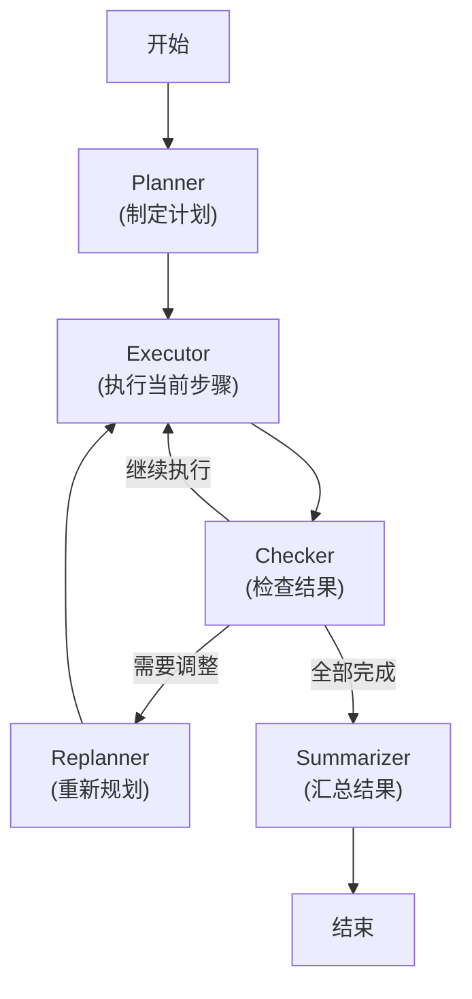

# Day 12 课程：Planning Agent — 让 Agent 学会制定计划 📋

在 Day 11 的 ReAct 模式中，Agent 每一步的决策都是**局部的**——它只看当前的情境来决定下一步做什么，没有全局的战略规划。这就像一个人走迷宫时只看脚下的路，而不是先登高俯瞰全局。

对于简单任务，ReAct 足够了。但当任务变得复杂（如"帮我调研 AI Agent 框架的发展现状，写一份 3000 字的报告"），逐步反应式的 Agent 往往会迷失方向、遗漏步骤、或者在细节中打转。

**Planning Agent** 正是为复杂任务而生的。它在执行任务之前，先制定一个**全局计划 (Plan)**，然后按计划逐步执行，遇到问题时还能动态调整计划。

---

## 目录
1. [学习目标](#学习目标)
2. [第一部分：Plan-and-Execute 模式](#第一部分plan-and-execute-模式)
3. [第二部分：动态重新规划](#第二部分动态重新规划)
4. [核心原理深度解析](#核心原理深度解析)
5. [课后练习](#课后练习)

---

## 学习目标
- 理解 Plan-and-Execute 架构：先规划后执行的两阶段模式。
- 学会使用 LLM 自动将复杂任务拆解为可执行的子任务列表。
- 掌握动态重新规划（Replanning）的触发条件和实现机制。
- 对比 ReAct 与 Planning 两种模式的适用场景。

---

## 第一部分：Plan-and-Execute 模式

### 1. 核心思想

Plan-and-Execute 将 Agent 的工作分为两个明确的阶段：

```
┌─────────────────────────────────────────────────────┐
│                  阶段一：规划 (Plan)                   │
│                                                     │
│  输入: 用户的复杂任务                                  │
│  输出: 有序的子任务列表                                │
│                                                     │
│  例如:                                               │
│  任务: "调研 Python Web 框架并推荐一个"                │
│  计划:                                               │
│    Step 1: 搜索目前主流的 Python Web 框架              │
│    Step 2: 对比各框架的性能、生态和学习曲线             │
│    Step 3: 根据用户场景给出推荐并说明理由               │
└─────────────────────────────────────────────────────┘
                         │
                         ▼
┌─────────────────────────────────────────────────────┐
│              阶段二：执行 (Execute)                    │
│                                                     │
│  逐步执行计划中的每个子任务                             │
│  每个子任务可以调用工具、查询知识库、或直接推理           │
│  每完成一步，将结果传递给下一步                         │
└─────────────────────────────────────────────────────┘
```

### 2. 计划的数据结构

```python
from pydantic import BaseModel, Field
from typing import List

class Step(BaseModel):
    """计划中的单个步骤。"""
    id: int = Field(description="步骤编号")
    description: str = Field(description="步骤描述")
    status: str = Field(default="pending", description="状态: pending/running/done/failed")
    result: str = Field(default="", description="执行结果")

class Plan(BaseModel):
    """Agent 的执行计划。"""
    goal: str = Field(description="最终目标")
    steps: List[Step] = Field(description="有序的步骤列表")
    current_step: int = Field(default=0, description="当前执行到第几步")
```

### 3. Planner（规划器）的实现

规划器的核心是一条专门的 LLM 调用链，负责将用户的任务拆解为步骤：

```python
PLANNER_PROMPT = """
你是一个任务规划专家。请将用户的复杂任务拆解为一系列有序的、可执行的子步骤。

规划原则：
1. 每个步骤应该是独立可执行的
2. 步骤之间有明确的依赖关系（后面的步骤可以依赖前面的结果）
3. 步骤数量控制在 3-7 个之间
4. 每个步骤的描述要具体、可操作

用户任务: {task}

请以 JSON 格式输出计划。
"""
```

### 4. Executor（执行器）的实现

执行器逐步处理计划中的每个步骤。每个步骤本身可以是一个小型的 ReAct Agent：

```
Plan: [Step1, Step2, Step3, Step4]

Executor 循环:
├── 执行 Step 1 (可能需要调用工具)
│   └── 结果保存到 Step1.result
├── 执行 Step 2 (可能基于 Step1 的结果)
│   └── 结果保存到 Step2.result
├── 执行 Step 3
│   └── 结果保存到 Step3.result
└── 执行 Step 4
    └── 最终结果 → 返回给用户
```

> 📖 **代码实战**：查看并运行 [04_plan_and_execute.py](file:///Users/huangyang/code/agent/project_05_advanced/04_plan_and_execute.py)

---

## 第二部分：动态重新规划

### 1. 为什么需要 Replanning？

现实世界充满不确定性，初始计划未必能完美执行：
- 某个步骤执行失败（工具报错、网络超时）
- 中间结果与预期不符，需要增加新步骤
- 用户在执行过程中追加了新需求

### 2. Replanning 的触发条件

| 触发条件 | 示例 | 处理方式 |
|---------|------|---------|
| 步骤执行失败 | 搜索工具返回空结果 | 重试或替换为其他工具 |
| 结果不符合预期 | 搜索结果与问题无关 | 修改查询条件重新搜索 |
| 发现新信息 | 执行中发现需要额外步骤 | 在计划中插入新步骤 |
| 用户追加需求 | "还要顺便翻译成英文" | 在计划末尾追加新步骤 |

### 3. Replanning 的实现流程

```
                 ┌──────────────┐
                 │  初始规划     │
                 └──────┬───────┘
                        │
                        ▼
              ┌─────────────────┐
              │ 执行当前步骤      │◄──────────────┐
              └────────┬────────┘               │
                       │                        │
                       ▼                        │
              ┌─────────────────┐               │
              │ 检查执行结果      │               │
              └───┬─────────┬───┘               │
                  │         │                   │
              成功 │         │ 失败/需调整        │
                  ▼         ▼                   │
           ┌──────────┐ ┌───────────┐           │
           │ 下一步骤  │ │ 重新规划   │           │
           └─────┬────┘ └─────┬─────┘           │
                 │            │                 │
                 │            ▼                 │
                 │     ┌────────────┐           │
                 │     │ 更新计划    │───────────┘
                 │     └────────────┘
                 ▼
           ┌──────────┐
           │ 所有步骤   │
           │ 完成？     │
           └──┬────┬──┘
           YES│    │NO ──────────────────────────┘
              ▼
        ┌──────────┐
        │ 汇总结果  │
        └──────────┘
```

### 4. Replanner Prompt

```python
REPLANNER_PROMPT = """
你是一个任务规划专家。根据当前的执行情况，评估是否需要调整计划。

原始目标: {goal}
当前计划: {plan}
已完成步骤及结果: {completed_steps}
当前步骤执行结果: {current_result}

请判断：
1. 当前步骤是否成功完成？
2. 是否需要修改剩余的计划？
3. 是否需要插入新的步骤？

如果需要调整，输出更新后的完整计划。
如果不需要调整，输出 "PLAN_OK"。
"""
```

> 📖 **代码实战**：查看并运行 [05_dynamic_replanning.py](file:///Users/huangyang/code/agent/project_05_advanced/05_dynamic_replanning.py)

---

## 核心原理深度解析

### ReAct vs. Planning 的适用场景

| 维度 | ReAct (反应式) | Planning (规划式) |
|------|--------------|-----------------|
| 任务复杂度 | 简单到中等 | 中等到复杂 |
| 步骤数量 | 1-5 步 | 5-20 步 |
| 是否需要全局视角 | 否 | 是 |
| Token 消耗 | 中等 | 较高（规划 + 执行） |
| 执行速度 | 较快 | 较慢（多了规划阶段） |
| 适用示例 | "查天气"、"算数学" | "写报告"、"做调研" |

### Plan-and-Execute 在 LangGraph 中的图结构



### 规划的粒度控制

计划的粒度（每步有多细）是一个需要权衡的设计决策：

| 粒度 | 优点 | 缺点 |
|------|------|------|
| 粗粒度（3步） | 灵活，每步内部自由度大 | 单步太复杂，可能执行不好 |
| 中等粒度（5-7步） | 平衡（推荐） | — |
| 细粒度（10+步） | 每步简单明确 | 规划本身消耗大量 Token，计划过于死板 |

---

## 课后练习

1. **规划质量评估**：给 Planner 相同的复杂任务，分别使用不同的大模型（DeepSeek、Qwen、Gemini），对比它们生成的计划质量（步骤合理性、覆盖完整性）。

2. **Replanning 触发实验**：设计一个场景，让 Agent 在执行第 2 步时必定失败（如搜索一个不存在的信息），观察 Replanner 如何调整后续计划。

3. **混合模式**：尝试设计一个"Planning + ReAct"混合架构——Planner 负责宏观规划，每个步骤的执行者是一个 ReAct Agent。

4. **Flake8 自检**：确保代码通过 `flake8 project_05_advanced/` 的检查。
