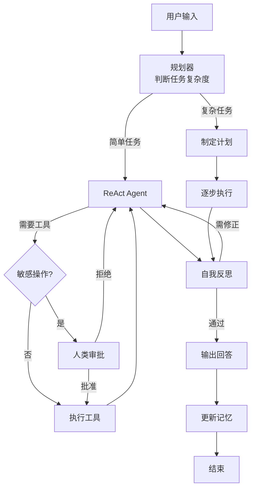

# Day 13 课程：自我反思 + 人类介入 + 综合 Super Agent 🦸

今天是高级 Agent 模式的最后一天。我们将学习三个让 Agent 从"能用"走向"可靠"的关键能力：

1. **自我反思 (Self-Reflection)**：Agent 检查自己的输出质量，发现问题后自主修正。
2. **人类介入 (Human-in-the-Loop)**：在关键决策点暂停执行，等待人类审批后继续。
3. **综合 Super Agent**：将前 12 天学到的所有能力整合成一个全功能 Agent。

---

## 目录
1. [学习目标](#学习目标)
2. [第一部分：自我反思 (Self-Reflection)](#第一部分自我反思-self-reflection)
3. [第二部分：人类介入 (Human-in-the-Loop)](#第二部分人类介入-human-in-the-loop)
4. [第三部分：综合 Super Agent](#第三部分综合-super-agent)
5. [核心原理深度解析](#核心原理深度解析)
6. [课后练习](#课后练习)

---

## 学习目标
- 掌握自我反思的两种实现方式：自评分和外部验证。
- 理解人类介入的设计模式和适用场景。
- 使用 LangGraph 的 `interrupt_before` 实现审批流程。
- 整合全部能力构建一个集大成的 Super Agent。

---

## 第一部分：自我反思 (Self-Reflection)

### 1. 为什么 Agent 需要自我反思？

大模型的输出不总是完美的。常见问题包括：
- **事实错误**：编造不存在的信息（幻觉）
- **逻辑漏洞**：推理过程有跳跃或矛盾
- **格式问题**：输出不符合要求的格式
- **不完整**：遗漏了用户需求中的某些部分

自我反思机制让 Agent 在给出最终回答之前，先对自己的输出进行一轮"质检"。

### 2. 反思的实现模式

#### 模式一：自评分 (Self-Grading)

让大模型对自己的回答进行质量评分：

```python
REFLECTION_PROMPT = """
请对以下 AI 回答进行质量评估。

用户问题: {question}
AI 回答: {answer}
参考资料: {context}  (如果有的话)

评估维度：
1. 准确性 (1-5分): 回答中的事实是否正确？
2. 完整性 (1-5分): 是否完整回答了用户的所有问题？
3. 清晰度 (1-5分): 表述是否清晰易懂？
4. 相关性 (1-5分): 是否紧密围绕用户问题？

综合评分 (1-5分):
- 如果综合评分 >= 4，输出 "PASS"
- 如果综合评分 < 4，指出具体问题并输出 "REVISE"

输出 JSON 格式:
{
  "scores": {"accuracy": 4, "completeness": 3, ...},
  "overall": 3,
  "verdict": "REVISE",
  "feedback": "回答遗漏了关于性能的部分..."
}
"""
```

#### 模式二：外部验证 (External Validation)

使用工具验证回答中的事实。例如：
- 数学计算：用计算器工具验证答案中的数字
- 代码：运行代码执行工具验证代码是否能正确执行
- 事实：用搜索工具交叉验证关键事实

### 3. 反思循环的图结构

```
         ┌────────────┐
         │  生成回答    │
         └─────┬──────┘
               │
               ▼
         ┌────────────┐
         │  自我评估    │
         └──┬──────┬──┘
            │      │
        PASS│      │REVISE
            ▼      ▼
      ┌────────┐ ┌──────────────┐
      │ 输出    │ │ 根据反馈修改   │
      │ 最终    │ │ 重新生成回答   │──────┐
      │ 回答    │ └──────────────┘      │
      └────────┘                        │
                                        ▼
                                 (回到"自我评估"，
                                  最多重试 3 次)
```

> 📖 **代码实战**：查看并运行 [06_self_reflection.py](file:///Users/huangyang/code/agent/project_05_advanced/06_self_reflection.py)

---

## 第二部分：人类介入 (Human-in-the-Loop)

### 1. 什么时候需要人类介入？

并非所有决策都应该由 Agent 自主完成。在以下场景中，引入人类审批是必要的：

| 场景 | 风险 | 人类介入方式 |
|------|------|------------|
| 删除文件 | 不可逆操作 | 执行前确认 |
| 发送邮件 | 可能造成沟通事故 | 审核内容后确认发送 |
| 数据库写入 | 可能污染数据 | 检查 SQL 语句后确认 |
| 大额支付 | 财务风险 | 金额确认 |
| 不确定的推理 | 可能误导用户 | 人类验证后再回答 |

### 2. LangGraph 的中断机制

LangGraph 提供了内置的 `interrupt_before` 和 `interrupt_after` 机制：

```python
# 在工具节点执行之前中断，等待人类审批
app = graph.compile(
    checkpointer=checkpointer,
    interrupt_before=["tools"]   # 执行 tools 节点前暂停
)
```

执行流程变为：
```
Agent 节点 → (决定调用工具) → ⏸️ 暂停，等待人类审批
                                    │
                            人类输入 "approve" / "reject"
                                    │
                              approve: 继续执行工具
                              reject:  跳过工具，重新推理
```

### 3. 实现审批流程

```python
# 第一次调用：Agent 推理并决定调用工具
result = app.invoke(
    {"messages": [HumanMessage(content="删除 old_data.csv")]},
    config={"configurable": {"thread_id": "session_1"}}
)

# 此时执行暂停在 tools 节点之前
# 获取 Agent 想要执行的操作
state = app.get_state(config)
pending_tool_calls = state.values["messages"][-1].tool_calls

print(f"Agent 想要执行: {pending_tool_calls}")
print("是否批准？(y/n)")

if input() == "y":
    # 批准：继续执行
    result = app.invoke(None, config)
else:
    # 拒绝：向消息中添加拒绝说明，让 Agent 重新推理
    from langchain_core.messages import ToolMessage
    reject_msg = ToolMessage(
        content="操作被用户拒绝。请不要执行删除操作。",
        tool_call_id=pending_tool_calls[0]["id"]
    )
    result = app.invoke({"messages": [reject_msg]}, config)
```

> 📖 **代码实战**：查看并运行 [07_human_in_the_loop.py](file:///Users/huangyang/code/agent/project_05_advanced/07_human_in_the_loop.py)

---

## 第三部分：综合 Super Agent

### 1. 能力全景图

将前 12 天的所有学习成果整合：

```
Super Agent 🦸
│
├── 🧠 推理引擎
│   ├── ReAct 思考链 (Day 11)
│   ├── Planning 任务规划 (Day 12)
│   └── Self-Reflection 自我反思 (Day 13)
│
├── 🔧 工具系统
│   ├── 数学计算 (Day 5-6)
│   ├── 网络搜索 (Day 6)
│   ├── 文件操作 (Day 6)
│   ├── 代码执行 (Day 6)
│   └── 知识库检索/RAG (Day 10)
│
├── 💾 记忆系统
│   ├── 短期记忆 - 对话历史 (Day 3)
│   ├── 长期记忆 - SQLite 持久化 (Day 8)
│   └── 语义记忆 - ChromaDB 向量库 (Day 9)
│
├── 🎭 角色系统
│   ├── System Prompt 人格设定 (Day 3)
│   └── 动态角色切换 (Day 3)
│
├── 🛡️ 安全机制
│   ├── Token 窗口管理 (Day 4)
│   ├── 错误处理与重试 (Day 6)
│   ├── 人类审批中断 (Day 13)
│   └── max_iterations 安全阀 (Day 6)
│
└── 📊 执行引擎
    └── LangGraph 状态机 (Day 7)
```

### 2. Super Agent 的 LangGraph 图结构



> 📖 **代码实战**：查看并运行 [08_super_agent.py](file:///Users/huangyang/code/agent/project_05_advanced/08_super_agent.py)

---

## 核心原理深度解析

### Agent 可靠性的三道防线

```
第一道防线：推理质量
├── ReAct 结构化思考
├── Planning 全局规划
└── 高质量 System Prompt

第二道防线：自动校验
├── Self-Reflection 自评分
├── 外部工具验证
└── 格式校验 (Pydantic)

第三道防线：人类监督
├── Human-in-the-Loop 审批
├── 日志审计
└── 敏感操作白名单
```

### 反思的 Token 成本分析

自我反思需要额外的 LLM 调用，会增加 Token 消耗：

| 阶段 | Token 消耗 |
|------|-----------|
| 初始生成 | ~500 tokens |
| 反思评估 | ~300 tokens |
| 修正重生成（如需要） | ~500 tokens |
| **总计（无修正）** | **~800 tokens** |
| **总计（有修正）** | **~1300 tokens** |

经验法则：反思约增加 60%-100% 的 Token 成本。对于关键任务（如面向客户的回答），这个成本是值得的；对于非关键的内部任务，可以跳过反思以节省成本。

---

## 课后练习

1. **自定义评估维度**：为你的特定应用场景设计专属的反思评估维度。例如，如果你的 Agent 是编程助手，评估维度可以是"代码可运行性"、"最佳实践遵循度"等。

2. **分级审批**：实现一个分级人类介入系统——低风险操作（如读文件）自动执行，中风险操作（如写文件）需要确认，高风险操作（如删除）需要二次确认并输入确认码。

3. **反思日志分析**：记录 100 次反思的结果，统计"PASS"和"REVISE"的比例，分析哪类问题最容易触发修正，据此优化 System Prompt。

4. **Flake8 自检**：确保代码通过 `flake8 project_05_advanced/` 的检查。
