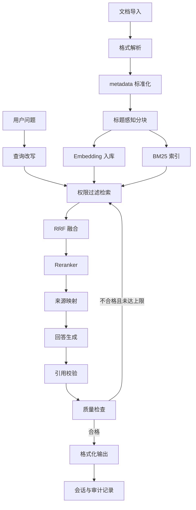

# 企业级 RAG 教学项目计划书

## 1. 项目概述

本项目是 AI Agent 课程的第 7 个综合项目，目标是在 Day 18-19 两天内，从基础 RAG 扩展到一个具备企业级关键能力的教学版 RAG 系统。项目重点不是追求一次性生产可用，而是让学习者理解生产级 RAG 的核心工程问题：混合检索、稳定元数据、权限过滤、引用校验、质量评估和 LangGraph 工作流编排。

项目最终交付一个可通过 CLI 演示的企业级 RAG 雏形，并配套离线评估和审计设计，为后续生产化改造打基础。

## 2. 项目目标

### 2.1 教学目标

- 理解基础 RAG 在企业场景下的主要缺口：单路检索、分块粗糙、无权限、无溯源、无评估闭环。
- 掌握混合检索路线：向量检索 + BM25 + RRF + Reranker。
- 掌握文档 metadata、`chunk_id`、`content_hash`、`tenant_id`、`acl_tags` 的设计意义。
- 掌握多轮问答中的查询改写、引用校验和质量检查工作流。
- 理解“教学版实现”和“生产级系统”之间的边界。

### 2.2 工程目标

- 支持 PDF、DOCX、Markdown、TXT 的本地导入。
- 支持标题感知分块，并保留可追溯 metadata。
- 支持向量检索与 BM25 关键词检索的 RRF 融合。
- 支持基于用户上下文的权限过滤。
- 支持引用标注、引用列表和引用校验。
- 支持 LangGraph 状态图编排、质量检查和有限重试。
- 支持最小离线评估集，记录 Recall@K、引用准确率和 groundedness。

## 3. 项目范围

### 3.1 本期范围

| 模块 | 内容 |
|------|------|
| 文档摄取 | 多格式加载、metadata 标准化、内容 hash |
| 分块 | 标题感知分块、chunk 稳定 ID、heading path |
| 检索 | ChromaDB 向量检索、BM25、RRF 融合 |
| 重排 | 专用 Reranker 优先，LLM 打分作为教学兜底 |
| 权限 | `tenant_id` + `acl_tags` 的最小权限过滤 |
| 记忆 | SQLite 会话历史、查询改写 |
| 引用 | `source_id` 映射、回答引用标注、引用校验 |
| 质量 | 基于证据的质量检查、重试策略、离线评估 |
| CLI | 文档导入、问答、会话、评估、审计命令 |

### 3.2 非本期范围

- 不实现完整 Web 后台和多用户登录系统。
- 不实现企业 SSO、RBAC 管理后台和审批流。
- 不实现分布式向量库集群运维。
- 不处理所有复杂文档版式，例如扫描 PDF、复杂表格、图片 OCR。
- 不承诺教学版可直接处理真实企业生产流量。

## 4. 用户与使用场景

| 用户 | 目标 | 典型场景 |
|------|------|----------|
| 学习者 | 理解企业级 RAG 工程结构 | 按 Day 18-19 课程逐步实现 |
| 课程维护者 | 维护严谨课程材料 | 更新模型、评估标准和生产化边界 |
| 原型开发者 | 快速验证内部知识库问答 | 导入少量文档，验证检索和引用质量 |

核心用户故事：

1. 作为学习者，我希望导入一份公司制度文档，并询问具体制度条款，系统能给出带引用的回答。
2. 作为学习者，我希望连续追问“它呢”“兼职员工呢”，系统能基于历史改写查询。
3. 作为学习者，我希望看到某次回答为什么可信，包括检索结果、引用来源和质量评分。
4. 作为系统设计者，我希望同一套架构能说明后续如何扩展到权限、审计和评估。

## 5. 技术路线

| 层级 | 教学版选型 | 生产化替代方向 |
|------|------------|----------------|
| LLM | OpenAI 兼容接口，复用课程模型工厂 | 企业模型网关、权限审计、调用限流 |
| Embedding | Qwen `text-embedding-v4` 或 Qwen3 Embedding；旧索引可保留 v3 | 托管 embedding 服务、批处理队列 |
| 向量库 | ChromaDB | Azure AI Search、Elasticsearch、OpenSearch、Milvus、pgvector |
| 全文检索 | `rank_bm25` + `jieba` | Elasticsearch/Azure AI Search/OpenSearch 中文分词 |
| Reranker | Qwen3 Reranker / bge-reranker / LLM 兜底 | 托管 rerank 服务或自部署 cross-encoder |
| 编排 | LangGraph | LangGraph + 持久化 checkpoint + 可观测平台 |
| 会话 | SQLite | PostgreSQL、Redis、托管会话服务 |
| 评估 | 本地 eval dataset + 指标脚本 | CI 评估、LangSmith/Ragas/DeepEval 等评估平台 |

## 6. 系统架构

## 7. 交付计划

### Day 18：检索与治理基础

| 序号 | 任务 | 交付物 | 验收标准 |
|------|------|--------|----------|
| 18.1 | 文档加载器 | `DocumentLoaderFactory` | 支持 PDF/DOCX/MD/TXT，metadata 字段完整 |
| 18.2 | 混合分块器 | `HybridChunker` | chunk 保留 `chunk_id`、`heading_path`、位置范围 |
| 18.3 | 向量检索 | `VectorStoreManager` | 可导入、检索、删除集合 |
| 18.4 | BM25 检索 | `KeywordSearcher` | 精确词、编号、错误码类问题可召回 |
| 18.5 | RRF 融合 | `HybridRetriever` | 能合并向量和 BM25 结果并去重 |
| 18.6 | 权限过滤 | `AccessFilter` | 不同租户/角色不能互相检索文档 |
| 18.7 | 评估集骨架 | `evaluation/datasets.py` | 至少 10 条 eval case，覆盖事实、精确匹配、多轮追问 |

### Day 19：工作流与质量闭环

| 序号 | 任务 | 交付物 | 验收标准 |
|------|------|--------|----------|
| 19.1 | 会话存储 | `ConversationStore` | 多会话隔离，可查询最近历史 |
| 19.2 | 查询改写 | `IntentResolver` | 5 组多轮追问中至少 4 组改写正确 |
| 19.3 | 引用映射 | `SourceTracker` | 回答引用使用 `[S1]` 格式，来源列表只展示实际引用 |
| 19.4 | 引用校验 | `CitationVerifier` | 不存在的引用 ID 会被拦截 |
| 19.5 | LangGraph 工作流 | `workflow.py` | 7 节点状态图可完整执行 |
| 19.6 | 质量检查 | `QualityChecker` | 资料不足时能输出“无法回答”，不编造 |
| 19.7 | CLI 应用 | `main.py` | 支持导入、问答、会话、评估、审计命令 |

## 8. 验收标准

### 8.1 功能验收

- 能导入至少 3 种格式文档。
- 能回答事实型问题，并附带来源引用。
- 能处理至少 3 轮连续追问。
- 能拒答知识库中没有证据的问题。
- 能展示一次回答的改写查询、检索候选、引用来源和质量评分。
- 权限过滤测试通过：用户 A 无法看到用户 B 的文档内容和来源。

### 8.2 质量验收

| 指标 | 目标 |
|------|------|
| Recall@5 | 核心评估集不低于 80% |
| Citation Accuracy | 人工抽查不低于 85% |
| Unsupported Answer Rate | 知识库无答案问题中不高于 10% |
| 多轮改写准确率 | 5 组测试中至少 4 组正确 |

### 8.3 文档验收

- Day 18 解释清楚混合检索、权限过滤、索引治理和评估基线。
- Day 19 解释清楚查询改写、引用校验、质量检查和重试策略。
- 明确标注教学版实现与生产环境差异。
- 不再把 LLM 自评、Prompt 引用标注、SQLite/ChromaDB/pickle 描述为完整企业级方案。

## 9. 风险与应对

| 风险 | 影响 | 应对 |
|------|------|------|
| 引用看似存在但不支撑答案 | 用户误信错误答案 | 增加 CitationVerifier 和人工抽查指标 |
| 重试拿到同一批文档 | 质量闭环无效 | 每次重试扩大 top-k 或生成 query variants |
| embedding 模型升级混用索引 | 检索结果异常 | 不同 embedding 模型使用不同 collection |
| 权限过滤遗漏 | 数据泄露 | 检索、重排、引用列表都使用同一 user_context |
| 文档解析丢失结构 | 检索证据不完整 | 保留 heading_path、页码、位置范围，复杂文档后续接 OCR/表格解析 |
| 课程范围膨胀 | 两天内无法完成 | 本期只做教学版闭环，生产能力以扩展方向呈现 |

## 10. 后续生产化路线

1. 接入真实身份系统：用户、组织、角色、用户组、文档 ACL。
2. 替换本地检索存储：使用支持 metadata filter 的托管检索服务。
3. 建立索引任务队列：文档新增、更新、删除、权限变化都异步重建。
4. 引入评估流水线：每次修改分块、检索、rerank、prompt 都跑 eval。
5. 完善可观测性：记录 trace、token、延迟、检索候选、质量评分和失败原因。
6. 增加人工反馈闭环：用户可标记回答是否有用、引用是否准确。

## 11. 当前资料依据

- 混合检索、BM25 + 向量、RRF、Reranker 仍是当前主流 RAG 路线。
- 新建 Qwen embedding 项目应优先评估 `text-embedding-v4` 或 Qwen3 Embedding/Reranker；旧 v3 索引需要独立保留，不应混用。
- LangGraph 适合需要状态、条件分支、重试、记忆和审计的 RAG 工作流。
- 教学版的 ChromaDB、SQLite、pickle 选择是为了降低学习成本，不代表生产默认方案。
