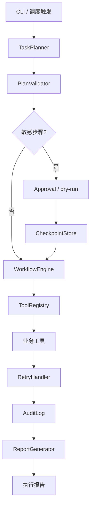

# 自动化业务流程 Agent 项目计划书

## 1. 项目概述

本项目是 AI Agent 课程的第 8 个综合项目，目标是在 Day 20-21 两天内，把前面课程中的工具调用、规划、LangGraph 状态机、多 Agent 协作能力，收敛成一个可运行的业务流程自动化 Agent。

项目采用“教学版可运行 + 生产边界清晰”的原则：本地实现工具注册、任务规划、执行引擎、重试、审计、报表生成和简化调度；同时明确指出生产环境需要持久化调度器、checkpoint、审批流、权限系统和可观测性平台。

## 2. 项目目标

### 2.1 教学目标

- 理解交互式 Agent 与流程自动化 Agent 的差异。
- 掌握 ToolRegistry 的工具元数据、权限、schema、审批和审计设计。
- 掌握结构化 ExecutionPlan、依赖拓扑排序和参数模板填充。
- 掌握执行引擎中的重试、降级、幂等和执行报告。
- 理解 MCP 与 ToolRegistry 的职责差异，以及 ADK、PydanticAI、OpenAI Agents SDK 等框架的工程取舍。
- 理解本地调度与生产级工作流编排的边界。

### 2.2 工程目标

- 提供一个可运行 CLI，支持直接输入业务指令并执行流程。
- 支持文件、CSV、数据统计、报表、通知等基础工具；Excel 作为可选扩展。
- 支持基于规则的本地 TaskPlanner，LLM 规划作为可选增强。
- 支持工具权限检查、敏感工具审批等待、执行审计。
- 支持失败重试、错误日志和执行报告。
- 支持简化定时任务注册和列表查询。

## 3. 项目范围

### 3.1 本期范围

| 模块 | 内容 |
|------|------|
| 工具注册 | `ToolRegistry`、`ToolMeta`、schema 校验、分组展示 |
| 治理 | `UserContext`、路径沙箱、敏感工具审批、审计日志 |
| 工具集 | 文件读写、CSV 读取、统计、报表写入、通知模拟 |
| 规划 | 规则规划器、计划校验、拓扑排序、参数模板 |
| 执行 | 顺序执行引擎、checkpoint/resume、重试、降级、幂等键、执行报告 |
| 调度 | 简化 `daily/weekly` 本地调度注册和查询 |
| CLI | `run`、`resume`、`plan`、`tools`、`history`、`errors`、`schedule`、`checkpoints` |

### 3.2 非本期范围

- 不实现真实企业微信、邮件、钉钉 API 发送。
- 不实现分布式 worker 和多实例调度锁。
- 不实现完整 Web 审批后台。
- 不实现真实 LangGraph 持久化 checkpointer 部署。
- 不承诺本地 `schedule` 风格调度满足生产级 SLA。

## 4. 技术路线

| 层级 | 教学版选型 | 生产化方向 |
|------|------------|------------|
| 编排 | Python 顺序执行引擎，结构映射 LangGraph 节点 | LangGraph + 持久化 checkpointer / Temporal |
| 规划 | 规则 planner + 可选 LLM | 结构化输出、plan validation、人工审核 |
| 工具 | Python 函数 + registry | MCP Server、服务化工具、权限网关、审计平台 |
| 表格 | CSV 标准库，Excel 可选 openpyxl | 数据仓库、BI、ETL 管道 |
| 重试 | 指数退避 + jitter | Prefect/Celery/Temporal task retry |
| 调度 | 本地简化 daily/weekly | APScheduler/Celery Beat/Prefect/Temporal |
| 审计 | JSONL 本地日志 | OpenTelemetry、LangSmith、SIEM |

## 5. 系统架构

## 6. 两日交付计划

### Day 20：工具注册与规划

| 序号 | 任务 | 交付物 | 验收标准 |
|------|------|--------|----------|
| 20.1 | 工具注册中心 | `tools/registry.py` | 能注册、查询、按组列出工具 |
| 20.2 | 治理策略 | `governance/policy.py` | 能判断角色权限和敏感工具 |
| 20.3 | 文件工具 | `tools/file_tools.py` | 读写限制在安全目录内 |
| 20.4 | 数据工具 | `tools/data_tools.py` | 能读取 CSV 并统计数值列 |
| 20.5 | 通知工具 | `tools/notify_tools.py` | 通知写入本地日志 |
| 20.6 | 任务规划 | `planner/task_planner.py` | 对日报/归档/通知类指令生成计划 |
| 20.7 | 计划校验 | `planner/plan_validator.py` | 能拦截未知工具、缺参、循环依赖 |

### Day 21：执行、容错与调度

| 序号 | 任务 | 交付物 | 验收标准 |
|------|------|--------|----------|
| 21.1 | 重试处理 | `error_handler/retry.py` | 支持指数退避、jitter、非幂等禁重试 |
| 21.2 | 执行引擎 | `executor/workflow_engine.py` | 可执行计划并生成报告 |
| 21.3 | Checkpoint | `executor/checkpoint_store.py` | 等待审批后可 resume |
| 21.4 | 报表生成 | `reports/report_generator.py` | 能生成 CSV 日报 |
| 21.5 | 调度器 | `scheduler/task_scheduler.py` | 可注册/list/remove 本地任务 |
| 21.6 | CLI | `main.py` | 支持运行、计划预览、恢复、历史、错误、调度 |
| 21.7 | 测试 | `tests/test_workflow.py` | 覆盖路径安全、CSV 统计、审批恢复 |

## 7. 验收标准

### 7.1 功能验收

- `/tools` 能按分组列出所有工具。
- `run 读取 data/sales.csv 生成日报` 在未审批时保存 checkpoint。
- `resume <run_id> --approve` 能从已成功步骤之后继续执行，并生成报告文件。
- 敏感工具默认等待审批，显式 `--approve` 后才执行副作用。
- 错误路径不会越过 `data/` 和 `reports/` 安全目录。
- `/history` 能看到最近执行记录。
- `/errors` 能看到失败工具调用日志。
- `/schedule add/list/remove` 能管理本地任务配置。

### 7.2 质量验收

| 指标 | 目标 |
|------|------|
| 计划校验 | 未知工具、缺参、循环依赖 100% 拦截 |
| 安全路径 | 目录穿越写入 100% 拦截 |
| 烟测 | 日报流程可在无 LLM 环境通过 |
| 审计 | 每个工具调用都有日志记录 |
| 恢复 | 审批恢复不会重复执行已成功步骤 |

## 8. 风险与应对

| 风险 | 影响 | 应对 |
|------|------|------|
| LLM 生成不可执行计划 | 流程失败或误操作 | 本期默认规则 planner，LLM 只作增强 |
| 敏感工具误执行 | 删除文件或误发通知 | 默认等待审批，审批后执行 |
| 路径穿越 | 读写非项目文件 | `resolve_safe_path` 限制目录 |
| 非幂等工具重试 | 重复通知或重复归档 | ToolMeta 标记 `idempotent=False` |
| 本地调度丢失 | 进程重启后任务消失 | 计划书标注教学限制，生产用持久化调度器 |

## 9. 后续生产化路线

1. 用 LangGraph checkpointer 或 Temporal 替代本地顺序执行。
2. 引入真实审批流和 Web 控制台。
3. 接入 OpenTelemetry/LangSmith 做 trace 和指标。
4. 把工具执行下沉到任务队列或 worker。
5. 增加数据库型 schedule store 和分布式锁。
6. 为每个工具增加 Pydantic schema 和单元测试。
7. 将高复用工具封装为 MCP Server，但继续由 ToolRegistry 负责权限、审批、限流和审计。
8. 评估 Google ADK、PydanticAI、OpenAI Agents SDK 等框架在结构化输出、观测和部署上的收益。

## 10. 当前技术判断

- LangGraph 工作流路线没有过时，但课程必须补 checkpoint、resume、审批、幂等和可观测性。
- `schedule` 库适合本地教学，不适合生产持久化调度。
- 当前生产工作流生态更强调 durable execution、task-level retries、trace 和 guardrails。
- MCP 正在成为 Agent 连接外部工具和上下文的重要标准，但不能替代本项目的工具治理层。
- 新 Agent 框架的核心价值不是“更自动”，而是让 schema、trace、eval、sandbox 和 deployment 更工程化。
