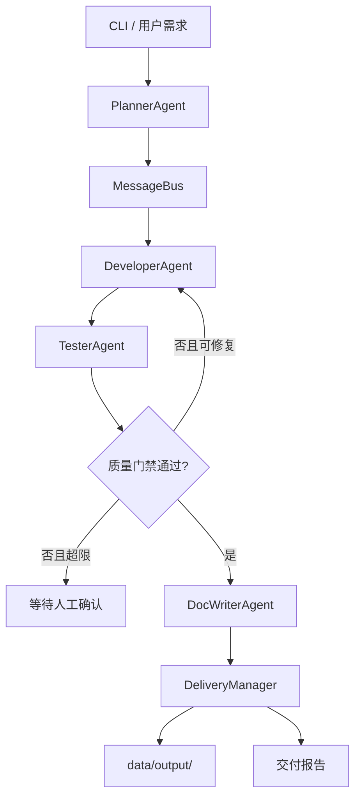

# 多智能体协同开发助手项目计划书

## 1. 项目概述

本项目是 AI Agent 课程的第 9 个综合项目，目标是在 Day 22-23 两天内构建一个本地可运行的“多智能体协同开发团队”。系统将用户需求拆解为开发计划，由规划、开发、测试、文档四类 Agent 通过消息总线协作，最终在安全工作区内交付代码、测试和文档。

本期采用“教学版可运行 + 工程边界清晰”的原则：不依赖真实 LLM 也能跑通完整流程；所有模型输出都先视为不可信产物，必须经过结构化解析、路径白名单、静态检查、测试和质量门禁后才允许落盘。

## 2. 技术判断

- 多 Agent 开发团队路线没有过时。LangGraph、OpenAI Agents SDK、AutoGen、CrewAI 都仍在支持多 Agent 编排、handoff、teams、flows 或 subagents。
- 课程需要修正“全自动交付”的表述。当前更合理的目标是“受控自动化”：确定性编排、专家 Agent、结构化产物、沙箱测试、人工审批、审计追踪。
- 对教学项目而言，本期先实现 Python 本地顺序编排；生产化可迁移到 LangGraph checkpointer、OpenAI Agents SDK tracing/guardrails、AutoGen team runtime 或 CrewAI Flows。
- MCP、Agent hooks、Google ADK、PydanticAI 等新生态可以补充工具接入、生命周期治理、部署、类型安全和评估能力，但不改变本课的核心判断：代码生成必须经过结构化校验、沙箱执行和质量门禁。
- 长程开发 Agent 的重点不是连续自动执行更多步骤，而是 checkpoint、hooks、sandbox、成本预算、人工中断和全链路 trace。

## 3. 项目目标

### 3.1 教学目标

- 理解多 Agent 与单 Agent 的边界和成本。
- 掌握 Planner/Developer/Tester/DocWriter 的职责隔离。
- 掌握 MessageBus、TaskAssignment、TaskResult 的消息通信。
- 掌握结构化产物、质量门禁、安全落盘和修复循环。
- 理解 MCP 在多 Agent 工具共享中的作用，以及 hooks、PydanticAI/ADK/Agents SDK 等框架与本项目的映射关系。
- 理解为什么开发团队 Agent 必须带沙箱和人工确认边界。

### 3.2 工程目标

- 提供 CLI，输入需求后生成一个本地项目交付包。
- 支持需求规划、代码生成、静态检查、修复、文档生成和交付报告。
- 支持消息历史追踪、产物清单、质量门禁报告。
- 支持路径安全校验，禁止绝对路径和目录穿越。
- 支持单元测试和烟测，确保无 LLM 环境也可运行。

## 4. 本期范围

| 模块 | 内容 |
|------|------|
| 角色 | Planner、Developer、Tester、DocWriter |
| 消息 | AgentMessage、MessageBus、优先级、历史追踪 |
| 规划 | 规则式需求拆解，默认支持 todo/calculator/notes 类需求 |
| 开发 | 生成 Python CLI 项目代码和测试文件 |
| 测试 | AST/文本静态检查 + `unittest` 执行 |
| 修复 | 根据测试反馈做有限轮次修复 |
| 交付 | 安全写入 `data/output/<project>/`，生成报告 |
| CLI | `run`、`plan`、`team`、`history`、`artifacts` |

## 5. 非本期范围

- 不实现真实 IDE 插件和 Git 自动提交。
- 不执行任意 shell 命令，只运行白名单 Python 测试。
- 不把 LLM 生成代码直接写入仓库根目录。
- 不保证生成项目达到生产可上线质量。
- 不接入真实 LangGraph checkpointer、OpenAI tracing 或 AutoGen runtime。
- 不在本期实现 MCP Server、远程开发沙箱或长程自主开发循环。

## 6. 架构设计

## 7. 两日交付计划

### Day 22：角色与消息

| 序号 | 任务 | 文件 | 验收 |
|------|------|------|------|
| 22.1 | 消息模型 | `messages/models.py` | 支持消息、任务、结果结构 |
| 22.2 | 消息总线 | `messages/bus.py` | 支持 send/receive/history |
| 22.3 | 角色定义 | `agents/roles.py` | 四个角色职责清晰 |
| 22.4 | Planner | `agents/planner.py` | 能拆解 todo/calculator/notes |
| 22.5 | Developer | `agents/developer.py` | 能生成结构化代码产物 |

### Day 23：编排与交付

| 序号 | 任务 | 文件 | 验收 |
|------|------|------|------|
| 23.1 | Tester | `agents/tester.py` | 能静态检查并运行测试 |
| 23.2 | DocWriter | `agents/docwriter.py` | 能生成 README/API/ARCHITECTURE |
| 23.3 | 安全交付 | `delivery.py` | 路径校验后写入输出目录 |
| 23.4 | 工作流 | `graph/workflow.py` | 支持开发-测试-修复循环 |
| 23.5 | CLI | `main.py` | 支持 run/plan/team/history/artifacts |
| 23.6 | 测试 | `tests/test_dev_team.py` | 覆盖消息、路径、完整流程 |

## 8. 验收标准

- `plan "做一个待办事项管理应用"` 能输出结构化任务计划。
- `run "做一个待办事项管理应用"` 能交付可运行 Python 项目。
- 交付路径必须位于 `project_09_dev_team/data/output/` 内。
- 质量门禁能拦截 CRITICAL/HIGH 问题。
- 消息历史能追踪每个 Agent 的任务和结果。
- 单元测试与烟测通过。

## 9. 生产化路线

1. 接入真实 LLM，并要求 Pydantic/JSON Schema 结构化输出。
2. 用 LangGraph checkpointer 保存每个节点状态。
3. 用容器或隔离进程运行生成项目测试。
4. 接入 OpenAI Agents SDK guardrails/tracing 或 LangSmith tracing。
5. 增加人工审批 UI 和 diff 预览。
6. 增加基准任务集，对生成质量做持续评估。
7. 把文件、仓库、测试、文档等能力封装为 MCP Server，并按 Agent 角色配置最小权限。
8. 把角色启动、handoff、工具调用、测试执行和交付前检查抽象为 hooks / middleware。
9. 引入 PydanticAI 或等价 schema/eval 框架，强化计划、代码产物、测试报告和交付报告的结构校验。
10. 扩展到长程开发模式时，必须增加 checkpoint、隔离沙箱、预算上限、人工中断点和审计 trace。
